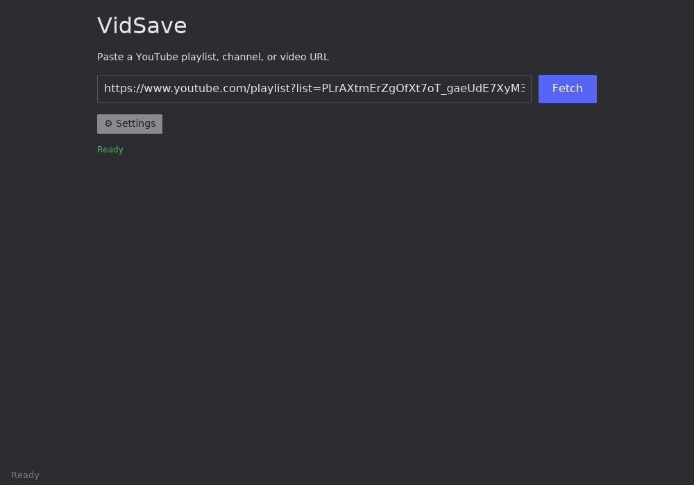
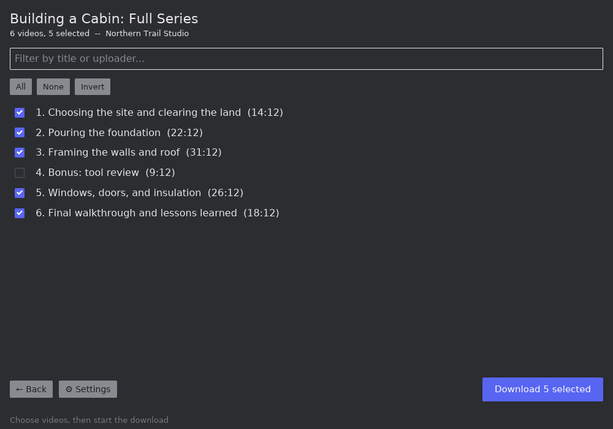
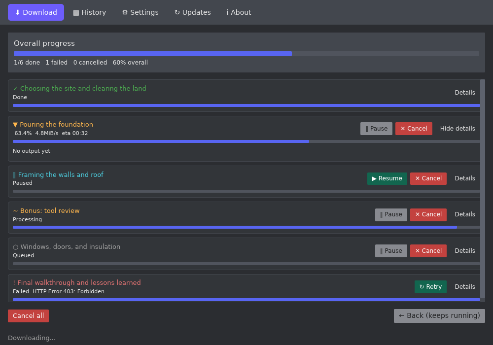

# VidSave

[](https://github.com/bel-wadoud/vidsave/actions/workflows/ci.yml)
[](https://github.com/bel-wadoud/vidsave/releases/latest)
[](LICENSE)

Download YouTube playlists and videos, as a desktop app or from the
terminal.

## Download

[](https://github.com/bel-wadoud/vidsave/releases/latest/download/vidsave-install-windows-x86_64.exe)
[](https://github.com/bel-wadoud/vidsave/releases/latest/download/vidsave-install-linux-x86_64)

Run the downloaded file (double-click on Windows, or `chmod +x` then run it
on Linux) and a setup window walks you through it: pick the desktop app,
the terminal version, or both, and it installs everything needed -- no
admin/root required. The desktop app gets a Start Menu / app-launcher
shortcut, just like any other app.

Prefer no installer? Grab the portable bundle instead -- unzip it anywhere
and run the app inside directly, nothing added to `PATH`:
[Windows](https://github.com/bel-wadoud/vidsave/releases/latest/download/vidsave-portable-windows-x86_64.zip) /
[Linux](https://github.com/bel-wadoud/vidsave/releases/latest/download/vidsave-portable-linux-x86_64.zip).
A [Docker image](#docker) is also available (terminal version only).

## Usage

Launch **VidSave** from your Start Menu / app launcher, paste a
playlist, channel, or video URL, pick which videos you want, adjust
quality/format/subtitles in Settings, then start the download.

<p>
  
  
  
</p>

Prefer a terminal? Run `vidsave-tui` from any terminal window instead --
it's the exact same app, keyboard-driven:

```sh
# start at the blank URL prompt
vidsave-tui

# jump straight into a playlist
vidsave-tui 'https://www.youtube.com/playlist?list=...'
```

| Screen | Keys |
|---|---|
| URL input | `Enter` fetch, `F2` settings |
| Video list | `Up`/`Down` move, `Space` toggle, `a`/`n`/`i` select all/none/invert, `/` filter, `Enter` start download |
| Settings | `Up`/`Down` move, `Left`/`Right`/`Enter` change value, `Shift+S` save |
| Downloading | `p` pause selected, `r` resume selected, `c` cancel selected, `C` cancel all, `Esc` back to the list |

Settings are saved to a config file in your platform's usual config
directory (e.g. `~/.config/vidsave/config.toml` on Linux) and shared
between the desktop app and the terminal version.

## Docker

```sh
docker build -t vidsave .
docker run --rm -it -v "$(pwd)/downloads:/downloads" vidsave
```

The image only runs the terminal version (the desktop app needs a display,
which a container doesn't have).

## Building from source

Requires a recent stable [Rust toolchain](https://rustup.rs).

```sh
cargo build --release -p vidsave       # desktop app
cargo build --release -p vidsave-tui   # terminal version
```

## License

[PolyForm Noncommercial License 1.0.0](LICENSE) -- free to use, modify, and
share for any noncommercial purpose. Commercial use is not permitted.
